# Dyna UI fix verification — 2026-10-02

## Delivered fixes

The confirmed UI defects from [the original manual pass](README.md) are fixed, along with an additional mobile defect found by regression testing.

| Finding                                                          | Change                                                                                                      | Verification                                                                                   |
| ---------------------------------------------------------------- | ----------------------------------------------------------------------------------------------------------- | ---------------------------------------------------------------------------------------------- |
| Empty search incorrectly claimed there were no collected signals | Search/filter-specific empty messages distinguish an empty view from empty collection coverage              | Light/dark browser regressions and manual internal-browser search                              |
| Backlog-only Brief said zero items                               | Scope includes deferred items; deferred work stays out of Act Now and gets an explicit Backlog explanation  | Light/dark regressions and manual Backlog filtering                                            |
| Linked tasks had no Done choice                                  | Queue, Progress and inspector offer Done with a required outcome; native task state remains independent     | Running/waiting tasks, both themes, outcome validation, cancellation and later synchronization |
| Done cards showed obsolete next actions                          | Cards show the one-line outcome, or `Completed · outcome not recorded.`                                     | Explicit Dyna completion, controller completion and manual missing-outcome synchronization     |
| Mobile completion could leave the board inaccessible             | Successful completion clears the disappearing inspector selection and restores focus to a surviving control | Mobile Chromium/WebKit regressions and manual 390px light-theme inspector completion           |

An experimental Queue handle change did not fix manual pointer dragging and was removed. The existing move menu, arrow-key shortcuts, single-open-menu behavior, Escape dismissal and touch sizing remain unchanged. No UI framework or dependency was added. The existing theme and font assignments remain unchanged.

## Final gates

- `bun run check`: passed, including 459 tests, formatting, lint, type checking, coverage, generated-bundle parity, license inventory and package validation.
- An earlier check running concurrently with the browser matrix returned 458 passes and one failure. The failed assertion fell outside its bounded output, so its cause is not established. The final full check ran separately and passed all 459 tests; no test was disabled or loosened to obtain that result.
- Focused Playwright matrix: **95 passed**, no failures or skips, across desktop Chromium, WebKit and Firefox plus mobile Chromium and WebKit. The final matrix also includes full-surface and note-modal accessibility checks. This is the affected-flow matrix, not the complete repository E2E suite.
- Existing manual-workflow and Backlog store fixtures passed. Explicit completion remains terminal under later native status synchronization, and does not certify native task success.
- Manual internal-browser checks confirmed scoped empty messages, Backlog counts, linked completion, displayed outcomes, retained native Running evidence, completion surviving synchronization, mobile return-to-board and keyboard Queue movement.
- The fixture browser captured no console warnings or errors in the final check.
- `.prettierignore`, `AGENTS.md` and `bun.lock` retain their pre-turn SHA-256 values. Generated changes are confined to Dyna's JavaScript bundle; no dependency or unrelated bundle change was introduced.

## Remaining verification limit

**Pointer drag is only partly manually verified.** A genuine internal-browser pointer drag moved a taskless Progress item from To Do to Needs You after waiting for the committed result. Queue pointer moves and a linked Progress-to-Done pointer move did not commit through the internal-browser pointer interface, including after standardizing the Queue handle. Their automated desktop drag tests pass in Chromium, WebKit and Firefox; status-menu and keyboard alternatives work manually. These results do not establish the cause or certify those physical-user gestures in the Codex WebView. No synthetic drag events were injected during manual testing.

The preview remains an isolated temporary harness using the current TypeScript backend. Native Codex controllers and external opening are simulated. This pass does not establish the Rust CLI-only cutover, installed-plugin upgrade, real session naming/navigation, source authentication or Mobile Remote parity. Live user dashboards were not modified. No commit, push, merge or plugin reload was performed.

## Screenshots

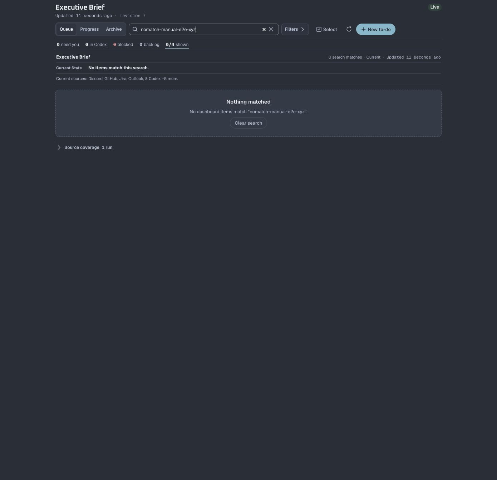

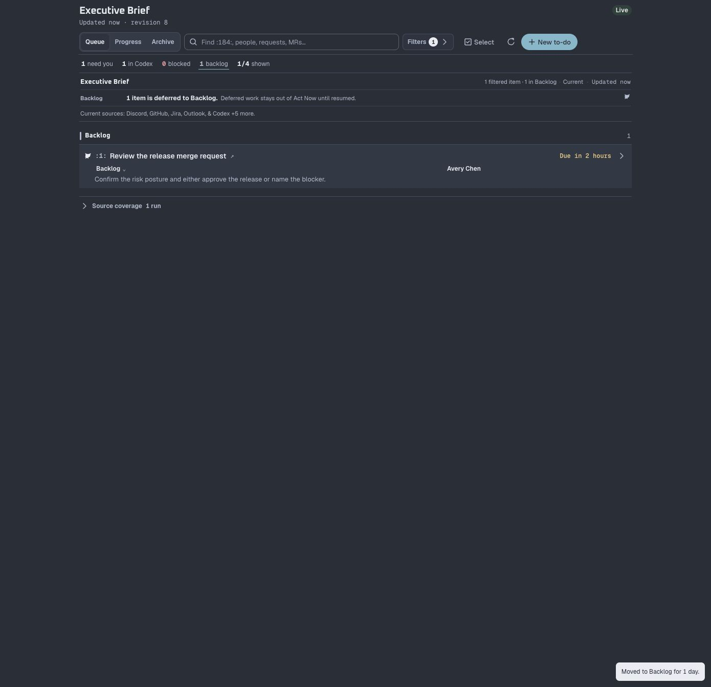

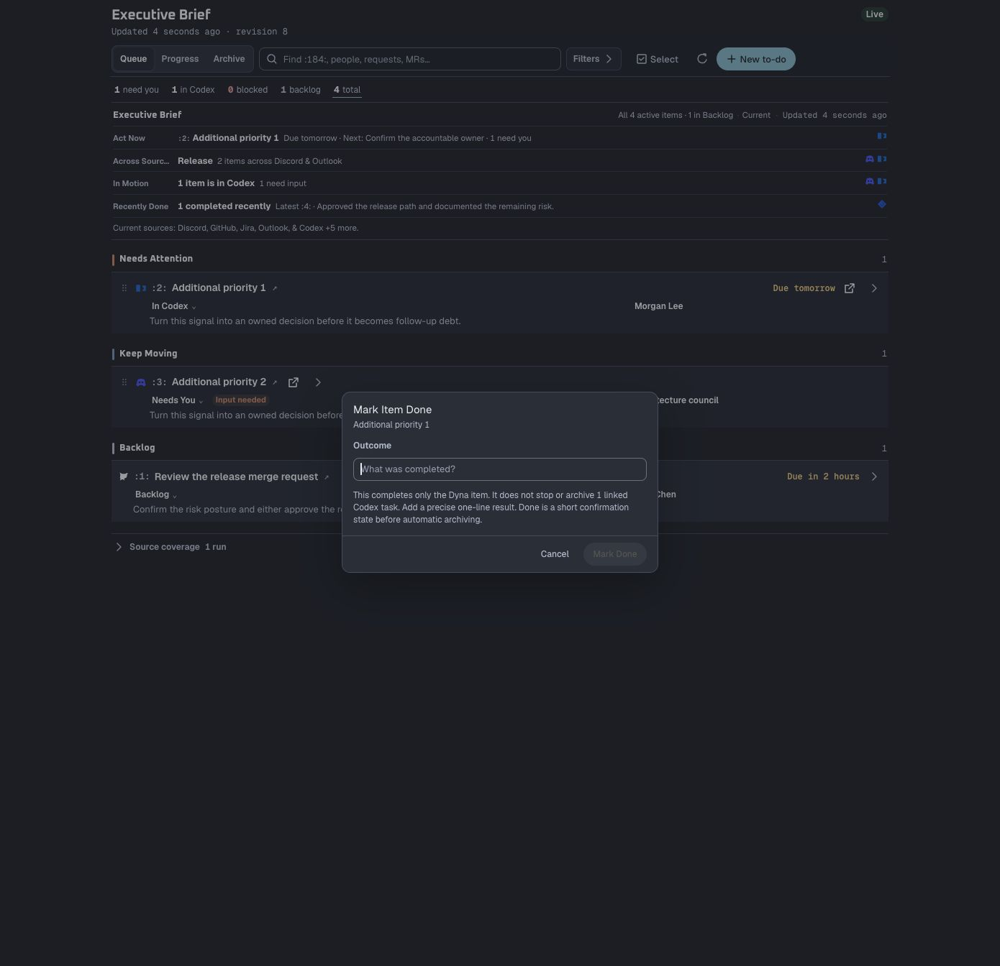

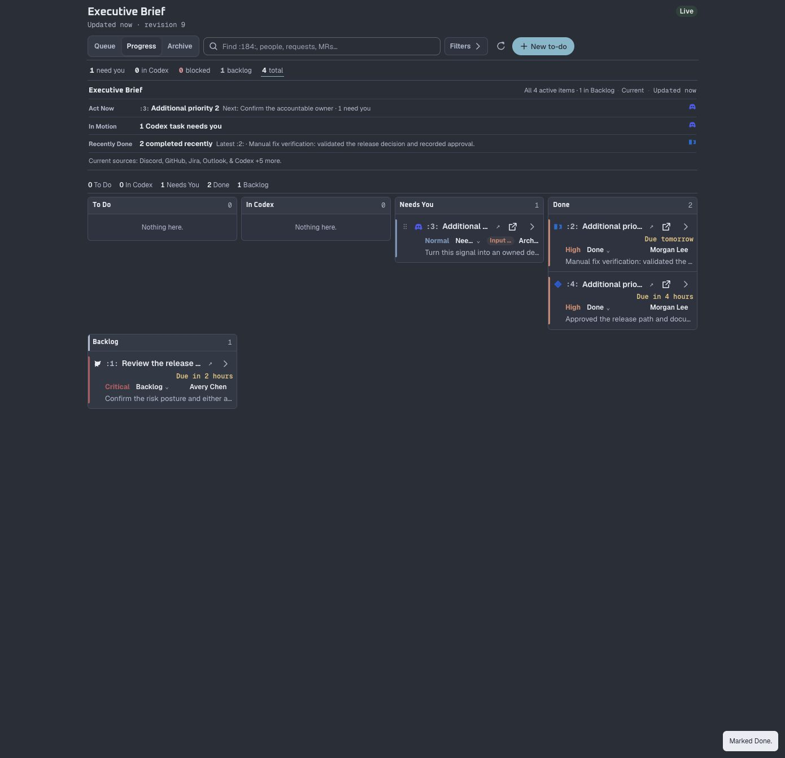

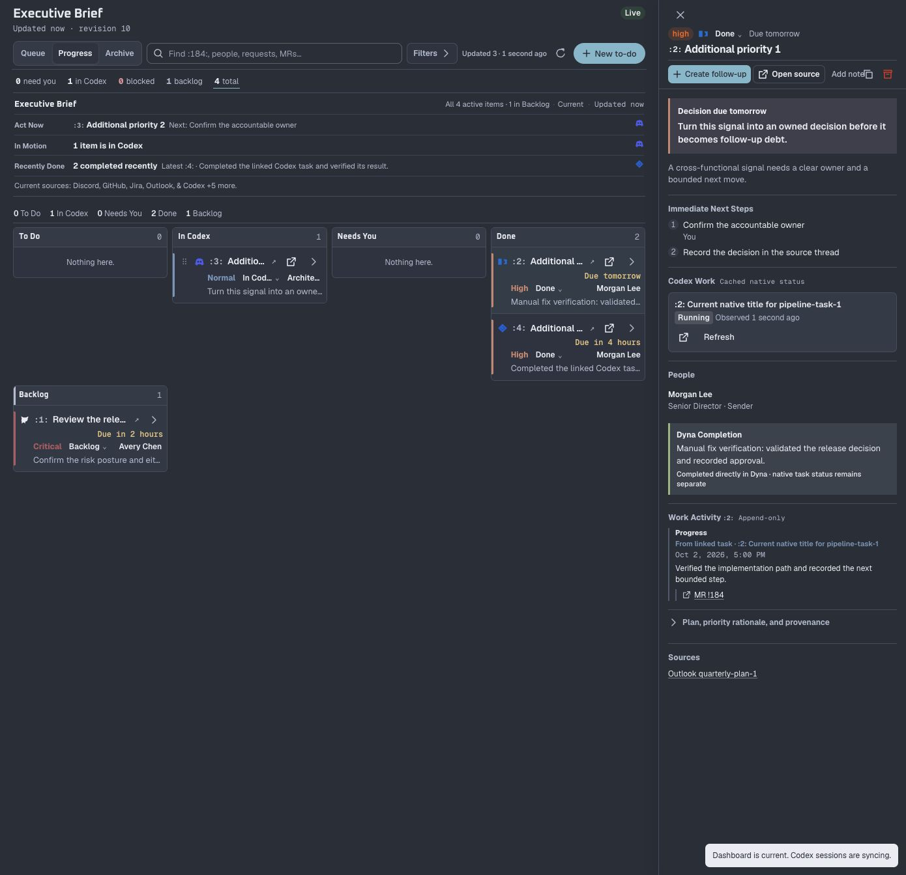

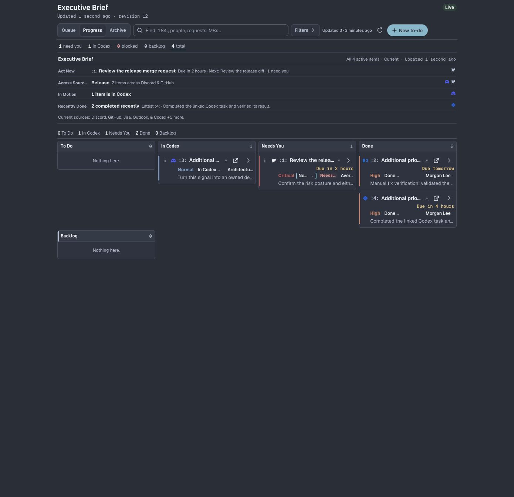

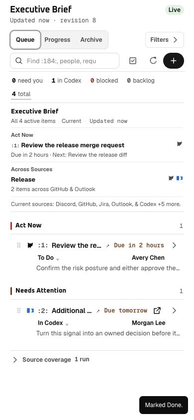

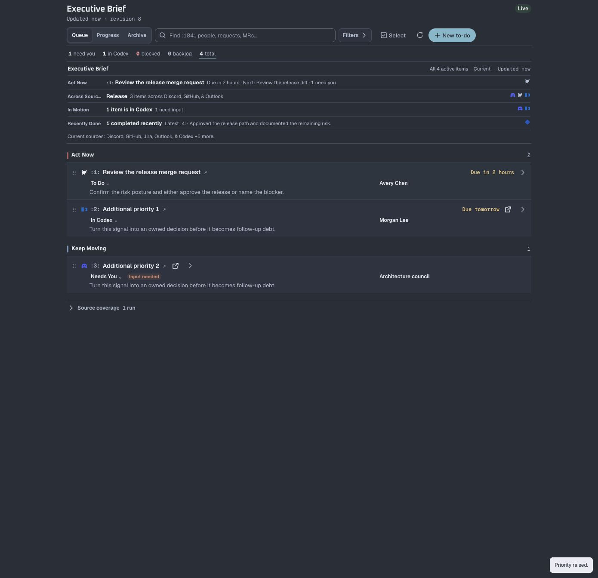

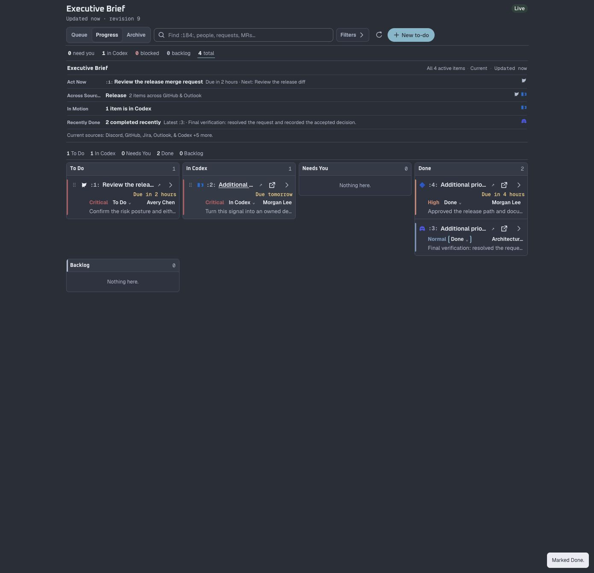

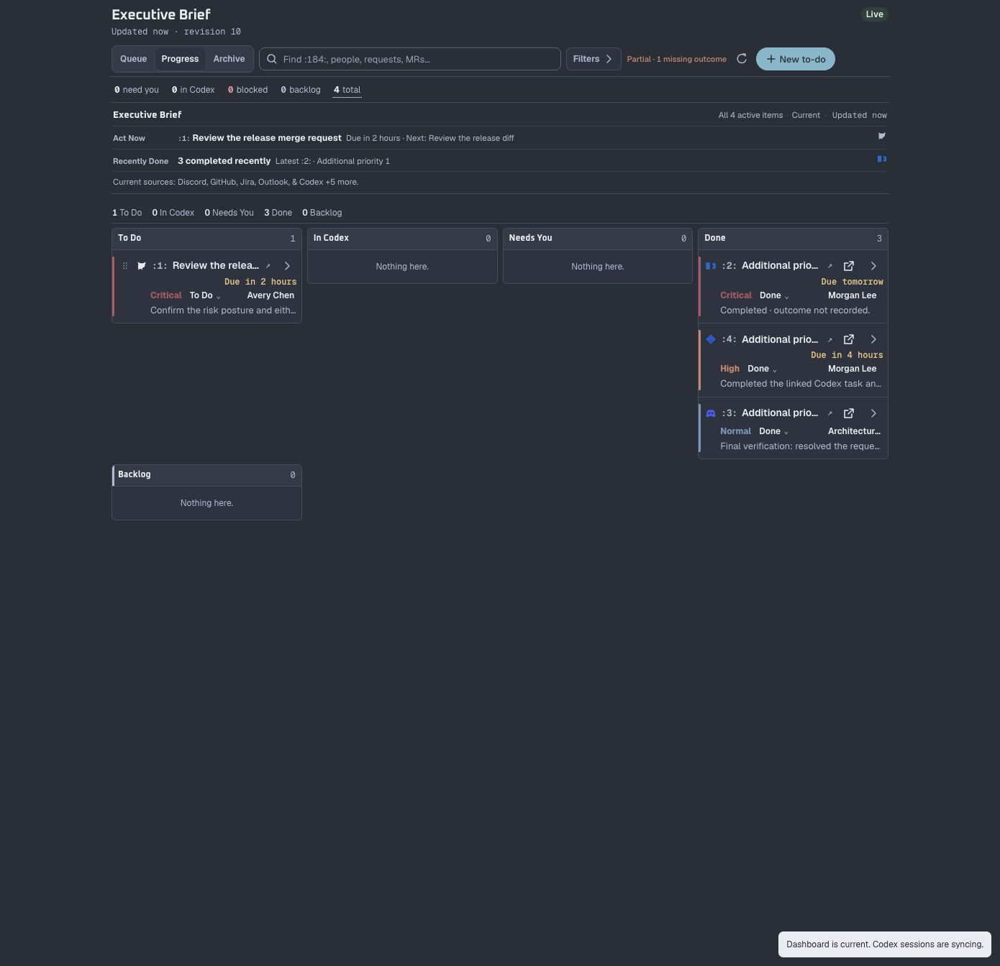

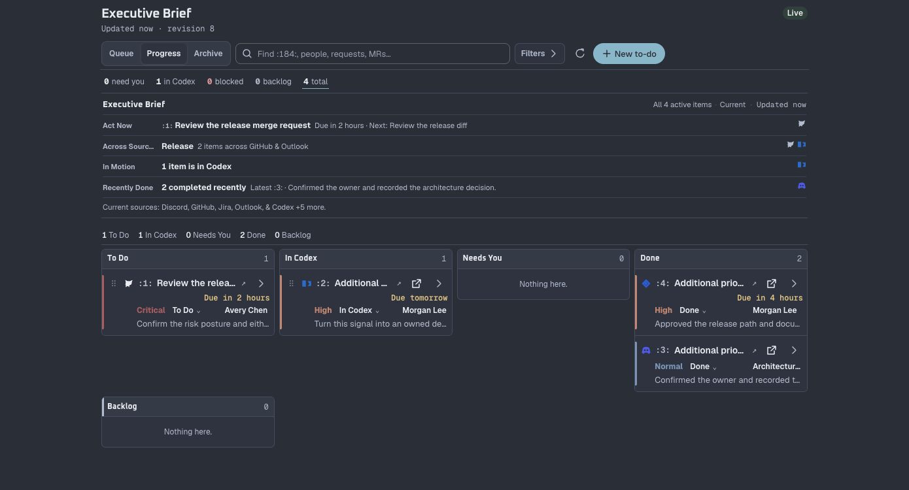
